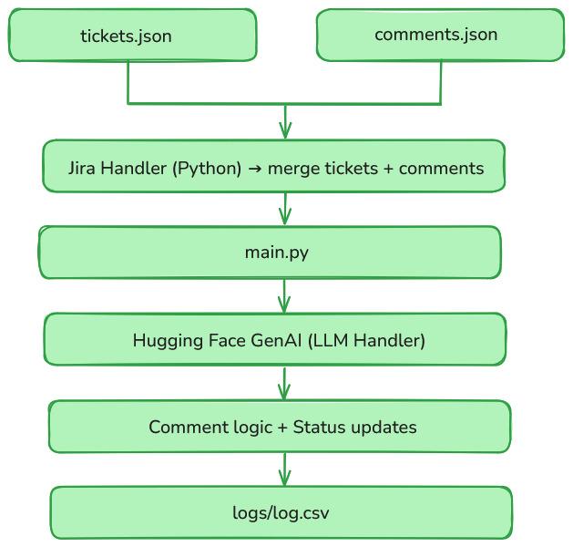

# AppSec Bot Assistant

An intelligent AI-powered assistant that monitors Jira tickets for high-risk vulnerabilities, interacts with developer comments, suggests remediation steps using GenAI, and updates ticket status in real time.

---

## Project Overview

This prototype simulates the behavior of a real AppSec engineer by:
- Polling Jira tickets (simulated using JSON)
- Reacting to developer comments
- Generating GenAI-based remediation advice
- Changing ticket status (e.g., to "In Testing")

Built using **Python**, **Hugging Face Transformers**, and clean modular code structure.

---

## Features

- Loads Jira-like vulnerability tickets  
- Monitors new comments from developers  
- Responds to comments using GenAI (Hugging Face: `flan-t5-base`)  
- Logs all actions (initial reply, remediation, fixed status) to CSV  
- Prints output like a conversation  
- Simple JSON-based simulation of Jira backlog and developer activity  

---

## Example Ticket Flow

1. Developer posts: `Need help with remediation for this XSS issue.`
2. Bot replies:
   - "Hi team, AppSec team is reviewing the comment..."
   - LLM-generated remediation for XSS
3. Developer follows up: `This has been fixed.`
4. Bot moves ticket status to `In Testing`

---

## LLM Integration

- Uses `google/flan-t5-base` model via Hugging Face pipeline  
- Prompt: `"How can I fix a {vulnerability_type} vulnerability?"`  
- Outputs remediation suggestions  
- Example:  
  To fix XSS, encode output, use Content Security Policy, avoid eval()

---

## Log Output (`logs/log.csv`)

| ticket_id | comment_type     | status      | timestamp           |
|-----------|------------------|-------------|---------------------|
| JIRA-001  | Initial-response |             | 2025-07-13 10:00:00 |
| JIRA-001  | LLM-response     |             | 2025-07-13 10:00:01 |
| JIRA-001  | Fixed            | In Testing  | 2025-07-13 10:00:10 |

---

## Getting Started

### 1. Clone the repo
```bash
git clone https://github.com/Mahima123-Patel/appsec-bot-assistant.git
cd appsec-bot-assistant
```

### 2. Create a virtual environment
```bash
python -m venv venv
.\venv\Scripts\activate  # On Windows
```

### 3. Install dependencies
```bash
pip install -r requirements.txt
```

### 4. Run the Bot
```bash
python main.py
```

## Architecture Diagram

- 

### Flow:

1. Load tickets from tickets.json

2. Load new dev comments from comments.json

3. Merge and check if latest comment is new

4. Respond using GenAI or templates

5. Update ticket status if resolved

6. Log all actions to log.csv

## Learnings / Tradeoffs

- Used Hugging Face instead of OpenAI to avoid quota limits
- Simulated polling with JSONs instead of live Jira API
- Modular design allows future plug-in of real Jira and Slack APIs
- Could be extended with Streamlit UI or chat interface

## Future Improvements

- Replace JSONs with live Jira REST API calls
- Add Slack bot or GitHub Issue support
- Build a real-time UI using Streamlit or Flask
- Add stateful chat history per ticket
- Auto-summarize tickets once resolved

## License
- MIT License

---